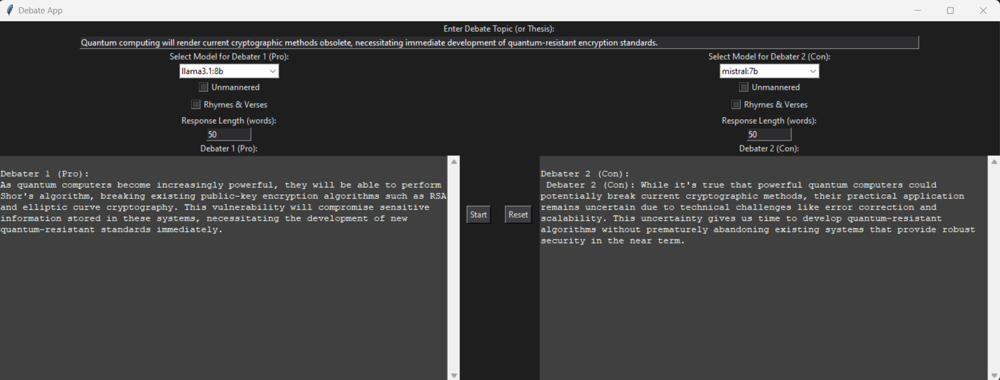

# AI-Debate: AI-Powered Debate Simulation



## Demonstration (YouTube link, CLick on the image below)

[](https://youtu.be/4n2aNJ0-7NQ)

## Overview

AI-Debate is an interactive application that simulates a debate between two AI-powered debaters. Users can configure various aspects of the debate, such as the length of responses, whether the debaters use rude language, and if they respond in rhymes. The application allows you to experiment with different models and configurations to see how AIs can argue on various topics.

## Features

- **Customizable Debates:** Set the number of words for each debater's response.
- **Personality Settings:** Choose whether debaters use rude language or respond in rhymes.
- **Model Flexibility:** Users can download and use various LLM models for different debating styles.

## Installation

### 1. Clone the Repository

```bash
git clone https://github.com/yourusername/ai-debate.git
cd ai-debate
```

### 2. Install Dependencies

Create and activate a virtual environment (optional but recommended):

```bash
python -m venv venv
source venv/bin/activate  # On Windows use `venv\Scripts\activate`
```

Then install the required packages:

```bash
pip install -r requirements.txt
```

### 3. Install Text-to-Speech (TTS)

To enable the text-to-speech functionality, follow the installation guide provided in the [RealtimeTTS GitHub repository](https://github.com/KoljaB/RealtimeTTS).

- **Note:** Ensure that you follow the instructions for installing the Coqui model and its dependencies.

### 4. Install Ollama

Ollama is a service that enables various LLM models to be used in your local environment.

- Download and install Ollama from the official website: [https://ollama.com/download](https://ollama.com/download)
- After installing Ollama, pull a language model to use with DebateAI, such as:

```bash
ollama pull llama3.1:8b
```

- You can download other models as well, allowing you to create debates between different LLMs.

## Usage

After setting up the environment and installing the necessary dependencies, you can run the application:

```bash
python debater.py
```

### Key Features

- **Debate Topic:** Input the topic or thesis for the debate.
- **Model Selection:** Choose different models for each debater to create dynamic and varied debates.
- **Response Length:** Set the desired word count for each debater's responses.
- **Behavioral Settings:** Bonus: Choose whether debaters should use rude language or speak in rhymes.

## Credits

This project utilizes several open-source projects:

- [RealtimeTTS](https://github.com/KoljaB/RealtimeTTS) for text-to-speech functionality.
- [Ollama](https://ollama.com) for accessing and running LLM models locally.

Special thanks to the developers of these tools and to the contributors of the libraries that made this project possible.


